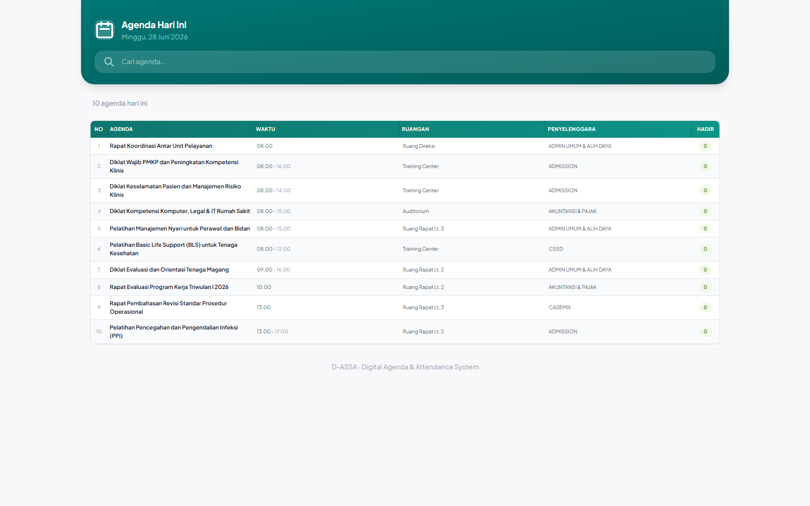
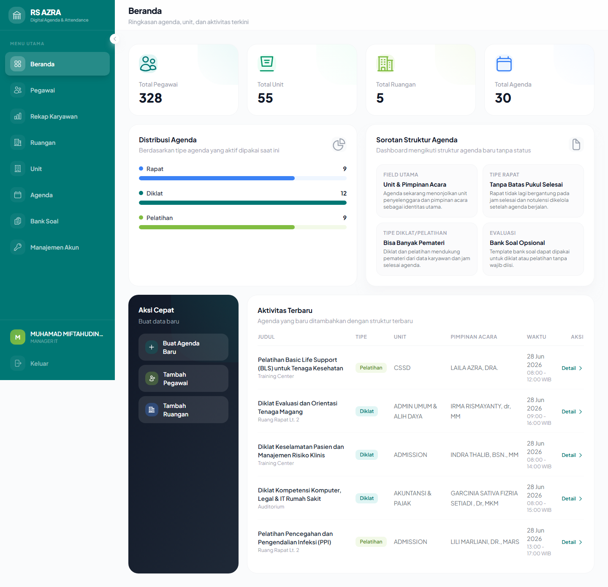
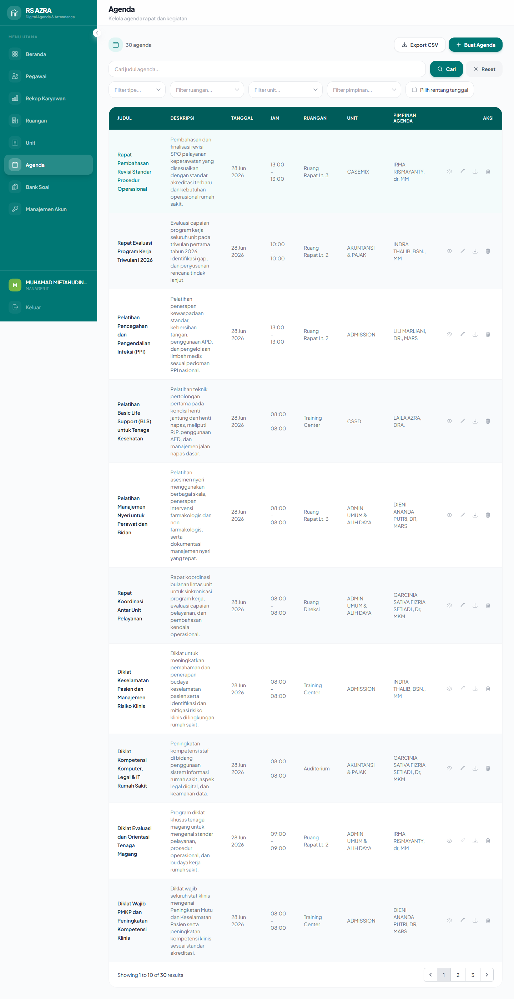
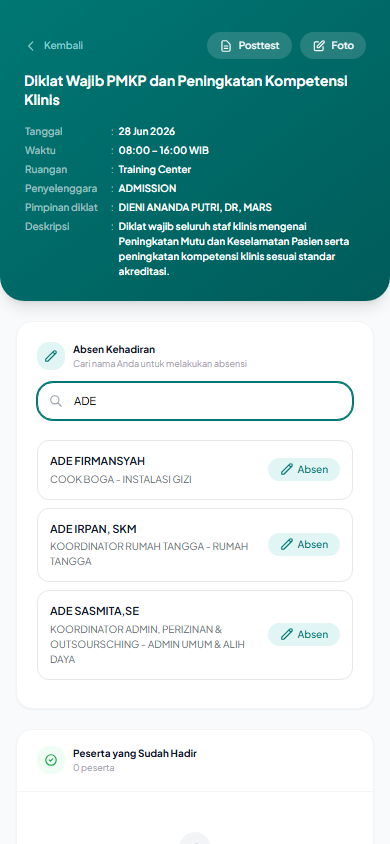
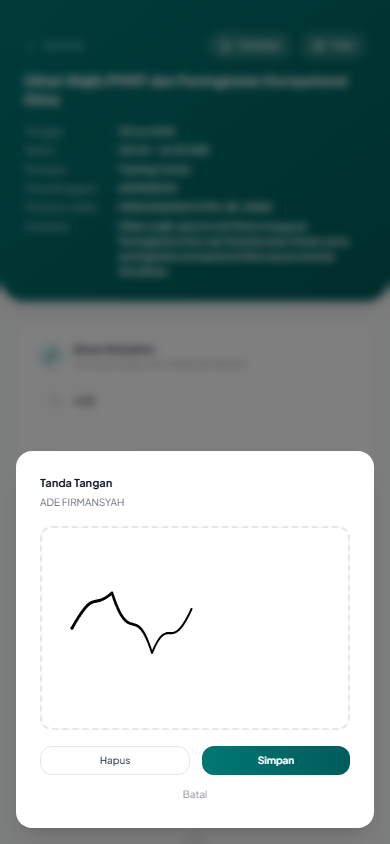
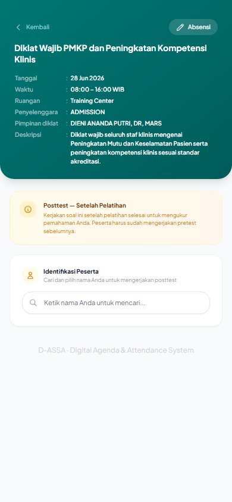
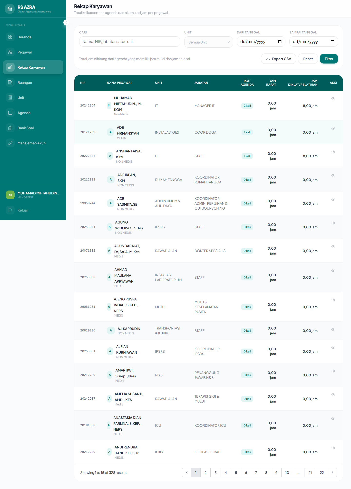

<div align="center">

# D-ASSA

### Digital Agenda & Self-Service Attendance

**A paperless platform for managing meetings & training, capturing attendance with on-screen digital signatures, and measuring learning impact with pre/post-test quizzes — all from a single web app.**

[](https://laravel.com)
[](https://www.php.net)
[](https://tailwindcss.com)
[](https://alpinejs.dev)
[](https://www.postgresql.org)

</div>

---

## The Problem

Organizations still run meetings and training sessions on paper: printed attendance sheets that get lost, manual recaps in spreadsheets, and no reliable way to prove who actually attended or whether training improved knowledge. The process is slow, error-prone, and impossible to audit.

## The Solution

**D-ASSA** replaces the entire paper trail with one connected workflow:

> **Schedule an agenda → participants self-check-in with a real signature on their phone → knowledge is measured with pre/post-tests → leadership gets instant, exportable recaps.**

No app to install. No hardware. Participants simply open a link, find their name, and sign with their finger.

---

## Screenshots

> 📸 Screenshots are generated automatically — see [`docs/screenshots/`](docs/screenshots/) to regenerate them.


*Public landing page — today's agendas, open to everyone, no login required*

| Admin Dashboard | Agenda Management |
| :---: | :---: |
|  |  |
| *At-a-glance KPIs: employees, units, rooms & agenda mix* | *Create meetings & training with rooms, leaders & presenters* |

| Self-Service Attendance | Digital Signature Pad |
| :---: | :---: |
|  |  |
| *Live search — participants find their name instantly* | *Sign in directly on a mobile screen* |

| Pre/Post-Test Quiz | Attendance & Quiz Recap |
| :---: | :---: |
|  |  |
| *Measure knowledge gain for every training session* | *Per-employee recaps, exportable to CSV & PDF* |

---

## Key Features

### 🗓️ Agenda & Event Management
- Manage three event types out of the box: **Rapat** (meetings), **Diklat** & **Pelatihan** (training).
- Assign a **room**, an **event leader**, and multiple **presenters** per agenda.
- Attach the official **invitation letter** and **training material** files.
- Generate a formal, print-ready **PDF** of any agenda.

### ✍️ Self-Service Attendance (No Login Required)
- Public check-in link per agenda — works on any phone browser.
- **Live name search** powered by Alpine.js for instant filtering.
- **HTML5 digital signature pad** — participants sign with their finger; the signature is stored as a PNG against their attendance record.
- **Double check-in prevention** ensures one signature per participant per event.

### 📊 Learning Measurement (Quizzes)
- Reusable **question bank (Bank Soal)** for training material.
- Automated **pre-test and post-test** flows attached to training agendas.
- Per-participant scoring to demonstrate measurable **knowledge gain**.

### 📝 Crowdsourced Documentation
- Public endpoints for participants to submit **meeting notes** and **photos**, building a shared record of every session.

### 📈 Reporting & Recaps
- **Per-employee attendance recaps** across all agendas.
- One-click **CSV export** for attendance, agendas, and **quiz results**.
- Formal **PDF export** for official documentation.

### 👥 Master Data & Access Control
- Centralized management of **Employees**, **Units**, and **Rooms**.
- Authentication via **Laravel Breeze**.
- **Role-based access** — sensitive operations (e.g. user account management) are restricted to the **MANAGER IT** role.

---

## Tech Stack

| Layer | Technology |
| --- | --- |
| **Backend** | Laravel 13 · PHP 8.3 |
| **Frontend** | Blade · Alpine.js 3 · Tailwind CSS 3 |
| **Database** | PostgreSQL (production) · SQLite (local/dev) |
| **Authentication** | Laravel Breeze |
| **PDF Engine** | barryvdh/laravel-dompdf · FPDF / FPDI |
| **Signatures** | `signature_pad` (HTML5 Canvas) |
| **Spreadsheets** | SheetJS (`xlsx`) — lazy-loaded for a lean main bundle |
| **Build Tooling** | Vite 8 |
| **Testing** | PHPUnit · Playwright (E2E) |

---

## Architecture at a Glance

```
Public (no auth)                 Admin (auth + roles)
─────────────────                ────────────────────
/                Today's agenda   /dashboard          KPIs & recent activity
/absen/{agenda}  Check-in + sign  /admin/agendas      Agendas + PDF/CSV export
/absen/.../quiz  Pre/Post-test    /admin/employees    Staff master data
/agenda/.../note Notes & photos   /admin/units|rooms  Org master data
                                  /admin/bank-soals   Question bank
                                  /admin/employee-recaps  Attendance reporting
                                  /admin/users        Account mgmt (MANAGER IT)
```

---

## Getting Started

### Prerequisites
- PHP 8.3+ and Composer
- Node.js 18+ and npm
- PostgreSQL (or SQLite for a quick local run)

### Installation

```bash
# 1. Install dependencies
composer install
npm install

# 2. Configure environment
cp .env.example .env
php artisan key:generate
# → set your DB_CONNECTION / DB_* values in .env

# 3. Create the storage symlink (for signatures & uploads)
php artisan storage:link

# 4. Run migrations (and seed demo data)
php artisan migrate --seed

# 5. Build frontend assets
npm run build
```

### Run locally

```bash
# Starts the PHP server, queue worker, log viewer and Vite together
composer dev
```

The app is then available at **http://localhost:8000**.

### Run the tests

```bash
composer test       # PHPUnit
npx playwright test # End-to-end browser tests
```

---

## Project Highlights

- **Mobile-first attendance** — designed for participants signing in on their own phones, no installs.
- **Verifiable records** — every check-in carries a real signature image and timestamp.
- **Measurable outcomes** — pre/post-test scoring turns training into auditable data.
- **Export-ready** — CSV and PDF outputs fit straight into existing reporting workflows.
- **Performance-conscious** — heavy libraries are code-split into lazy chunks to keep load times fast.

---

<div align="center">

**D-ASSA** — turning paper-based meetings and training into a measurable, auditable digital workflow.

</div>
